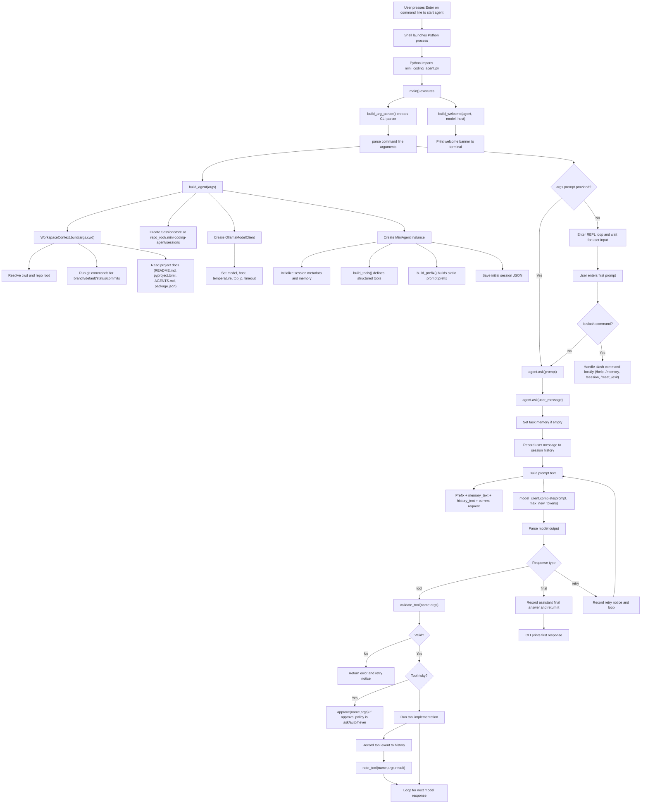

```mermaid
graph TD;
    A["User presses Enter on command line to start agent"];
    B["Shell launches Python process"];
    C["Python imports mini_coding_agent.py"];
    D["main() executes"];
    E["build_arg_parser() creates CLI parser"];
    F["parse command line arguments"];
    G["build_agent(args)"];
    G1["WorkspaceContext.build(args.cwd)"];
    G1a["Resolve cwd and repo root"];
    G1b["Run git commands for branch/default/status/commits"];
    G1c["Read project docs (README.md, pyproject.toml, AGENTS.md, package.json)"];
    G2["Create SessionStore at repo_root/.mini-coding-agent/sessions"];
    G3["Create OllamaModelClient"];
    G3a["Set model, host, temperature, top_p, timeout"];
    G4["Create MiniAgent instance"];
    G4a["Initialize session metadata and memory"];
    G4b["build_tools() defines structured tools"];
    G4c["build_prefix() builds static prompt prefix"];
    G4d["Save initial session JSON"];
    H["build_welcome(agent, model, host)"];
    I["Print welcome banner to terminal"];
    J{"args.prompt provided?"};
    K["agent.ask(prompt)"];
    L["Enter REPL loop and wait for user input"];
    M["User enters first prompt"];
    N{"Is slash command?"};
    O["Handle slash command locally (/help, /memory, /session, /reset, /exit)"];
    K1["agent.ask(user_message)"];
    K2["Set task memory if empty"];
    K3["Record user message to session history"];
    K4["Build prompt text"];
    K4a["Prefix + memory_text + history_text + current request"];
    K5["model_client.complete(prompt, max_new_tokens)"];
    K6["Parse model output"];
    K7{"Response type"};
    K7a["Record assistant final answer and return it"];
    K8["validate_tool(name,args)"];
    K9{"Valid?"};
    K9a["Return error and retry notice"];
    K10{"Tool risky?"};
    K10a["approve(name,args) if approval policy is ask/auto/never"];
    K11["Run tool implementation"];
    K12["Record tool event to history"];
    K13["note_tool(name,args,result)"];
    K14["Loop for next model response"];
    K15["Record retry notice and loop"];
    P["CLI prints first response"];

    A --> B;
    B --> C;
    C --> D;
    D --> E;
    E --> F;
    F --> G;
    G --> G1;
    G1 --> G1a;
    G1 --> G1b;
    G1 --> G1c;
    G --> G2;
    G --> G3;
    G3 --> G3a;
    G --> G4;
    G4 --> G4a;
    G4 --> G4b;
    G4 --> G4c;
    G4 --> G4d;
    D --> H;
    H --> I;
    F --> J;
    J -- Yes --> K;
    J -- No --> L;
    L --> M;
    M --> N;
    N -- Yes --> O;
    N -- No --> K;
    K --> K1;
    K1 --> K2;
    K2 --> K3;
    K3 --> K4;
    K4 --> K4a;
    K4 --> K5;
    K5 --> K6;
    K6 --> K7;
    K7 -- final --> K7a;
    K7 -- tool --> K8;
    K8 --> K9;
    K9 -- No --> K9a;
    K9 -- Yes --> K10;
    K10 -- Yes --> K10a;
    K10 --> K11;
    K11 --> K12;
    K12 --> K13;
    K13 --> K14;
    K7 -- retry --> K15;
    K7a --> P;
    K11 --> K14;
    K15 --> K4;
```