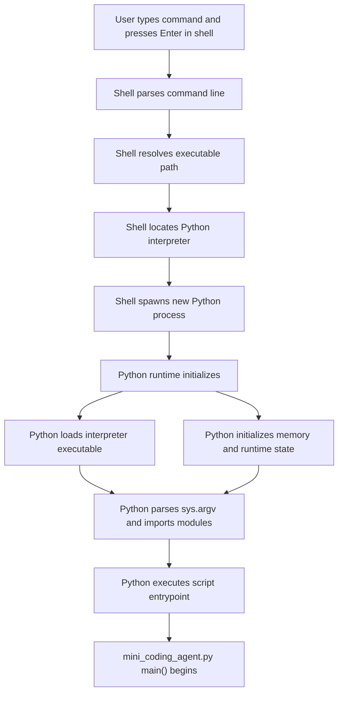

# Shell launches Python process

[Back to diagram map](diagram_hierarchy.html)

**Parent diagram:** [Info flow: enter to first response](info_flow_enter_to_first_response.md)

**Child diagrams:** none

