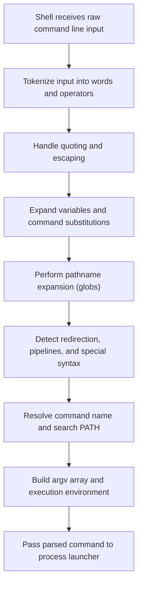

# Shell parses command line

[Back to diagram map](diagram_hierarchy.html)

**Parent diagram:** [Shell launches Python process](shell_launches_python_process.md)

**Child diagrams:** none

```mermaid
graph TD;
    A["Shell receives raw command line input"];
    B["Tokenize input into words and operators"];
    C["Handle quoting and escaping"];
    D["Expand variables and command substitutions"];
    E["Perform pathname expansion (globs)"];
    F["Detect redirection, pipelines, and special syntax"];
    G["Resolve command name and search PATH"];
    H["Build argv array and execution environment"];
    I["Pass parsed command to process launcher"];

    A --> B;
    B --> C;
    C --> D;
    D --> E;
    E --> F;
    F --> G;
    G --> H;
    H --> I;
```